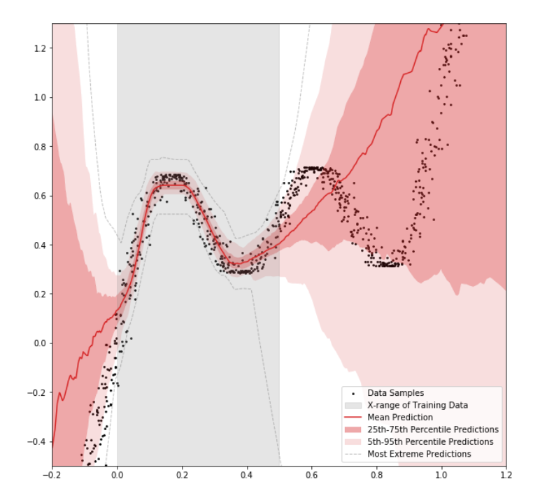

# Bayesian-Neural-Networks

This repository aims at replicating results of the paper ["Weight Uncertainty in Neural Networks"](https://arxiv.org/pdf/1505.05424.pdf) by Blundell et al, 2015. In addition to that, we ra several experiments such as running the model on Out-of-Distribution Data or an Adversarial Attacks analysis.     
This work was carried out as part of a project at the Technische Universität Berlin and in collaboration with Denis Semko Androsenko.     Please consider the 3 documents covering our whole research study:

- Milestone 1 : [Datasets and Prototype](https://drive.google.com/file/d/1fMDC3b7RzEvIWKKDwLbuG6ANCpz-FVgu/view?usp=sharing)
- Milestone 2 : [Model Selection and Evaluation](https://drive.google.com/file/d/15CgosRmIvBUUllRTCP-UXRy4emv5pxUj/view?usp=sharing)
- Milestone 3 : [The Final Prediction Method](https://drive.google.com/file/d/1lcsr92ypfYu9Si5vMam5v_A-bM30_3F0/view?usp=sharing)
